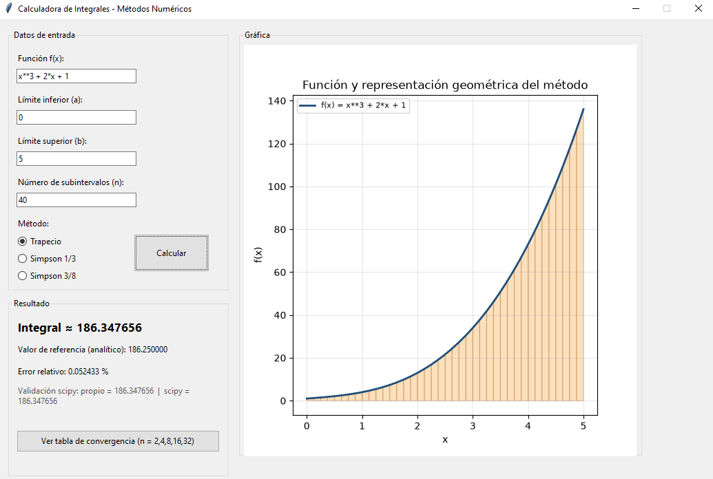

# Calculadora de Integrales — Métodos Numéricos

Software desarrollado en Python que aproxima integrales definidas mediante los métodos numéricos del **trapecio**, **Simpson 1/3** y **Simpson 3/8**, implementados desde cero siguiendo el enfoque de Chapra & Canale (_Métodos numéricos para ingenieros_).

El proyecto incluye una interfaz gráfica para calcular integrales de forma interactiva, y un script de experimentación que genera tablas y gráficas comparando la precisión de los tres métodos sobre distintas funciones de prueba.

## Interfaz principal



## Funcionalidades

- Implementación propia de trapecio, Simpson 1/3 y Simpson 3/8.
- Interfaz gráfica (tkinter) para ingresar una función, sus límites de integración, el número de subintervalos y el método a usar.
- Gráfica de la función junto con la representación geométrica del método aplicado.
- Ventana de simulación con tabla de convergencia del error.
- Validación cruzada de los resultados propios contra `scipy.integrate`.
- Script de experimentos que genera gráficas de convergencia del error (escala log-log) para varias funciones de prueba.

## Estructura del proyecto

```
calculadora_integrales/
├── metodos_numericos.py   # Algoritmos propios: trapecio, simpson1/3, simpson3/8
├── gui.py                 # Interfaz gráfica (software principal)
├── experimentos.py        # Genera tablas y gráficas de convergencia
├── requirements.txt
├── assets/
└── resultados/            # Gráficas generadas por experimentos.py
```

## Requisitos

- Python 3.10 o superior
- `tkinter` (incluido con Python; en Linux puede requerir `sudo apt install python3-tk`)

## Instalación y uso local

```bash
# 1. Clonar el repositorio
git clone https://github.com/CesarAQ/Calculadora-Integrales.git
cd <tu-repo>

# 2. Crear entorno virtual (opcional pero recomendado)
python -m venv venv
venv\Scripts\activate       # Windows
source venv/bin/activate    # Mac/Linux

# 3. Instalar dependencias
pip install -r requirements.txt

# 4. Ejecutar la interfaz gráfica
python gui.py

# 5. (Opcional) Generar tablas y gráficas de convergencia
python experimentos.py
```

Al ejecutar `gui.py` se abre la calculadora: escribe una función (por ejemplo `x**3 + 2*x + 1`, `sin(x)`, `exp(-x**2)`), define los límites y el número de subintervalos, elige un método y presiona **Calcular**.

## Referencia teórica

Chapra, S. C., & Canale, R. P. (2015). _Métodos numéricos para ingenieros_ (7.a ed.). McGraw-Hill Education.
